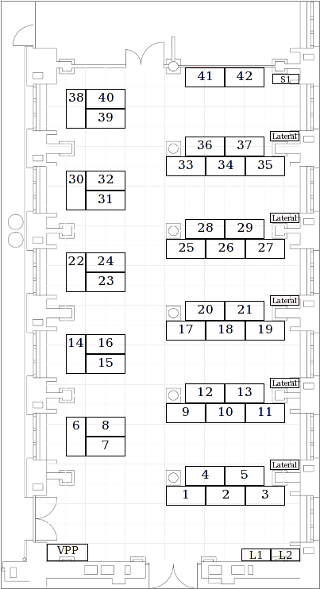
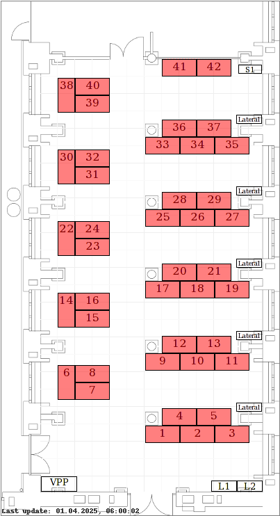

# D-INFK Master Thesis Lab Reservation Checker
The D-INFK Master Thesis Lab is a great place to work because it has plenty of space in a quiet environment.
But to work there, a registration is required, which can only be made by D-INFK staff members.

However, there usually are some desks that are not reserved, but people will get angry if you steal their seat.

You can check out the current reservations at <a href="https://cab-e-81.inf.ethz.ch/reservation/overview">https://cab-e-81.inf.ethz.ch/reservation/overview</a>, but the overview is not very well designed.

So, out of procrastination I wrote a little script to parse their page and display the reservation status for each table on the plan:

 

